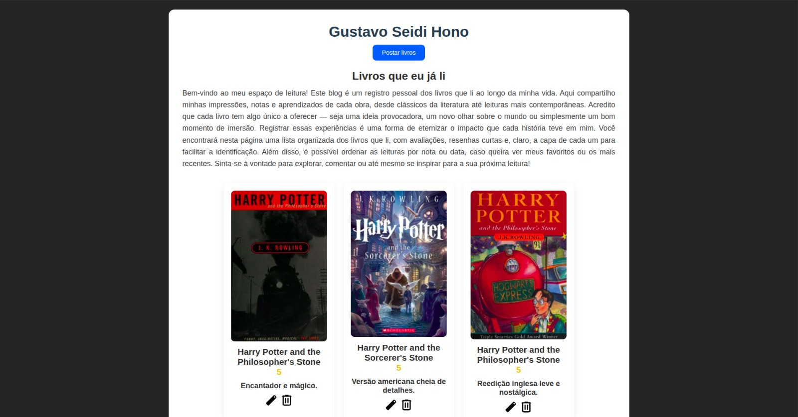
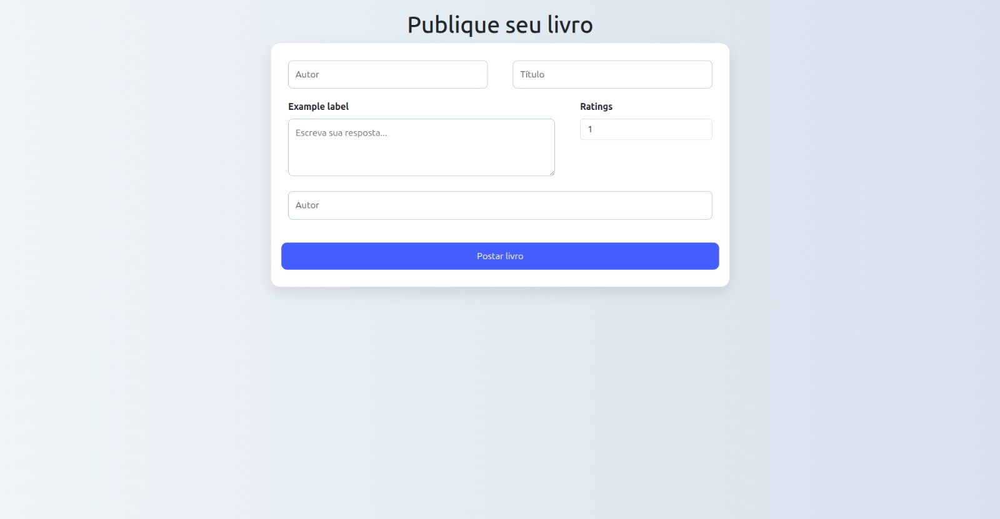
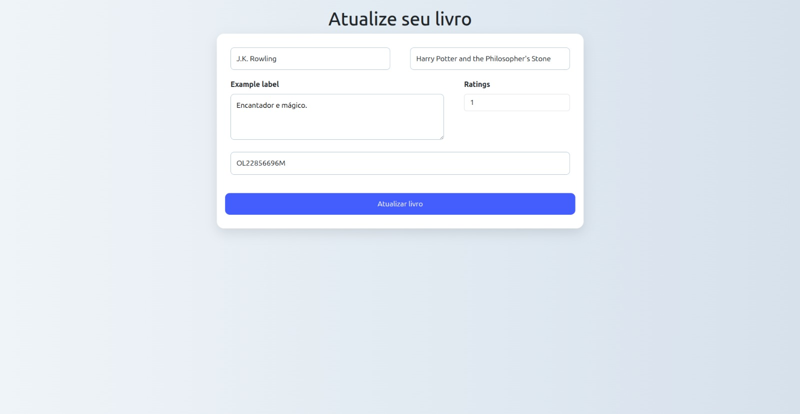

# Projeto de Livros já lidos


## Descrição
Um blog pessoal de resenhas literárias onde o usuário pode adicionar, editar e deletar livros que já leu. Desenvolvido com Node.js, Express, PostgreSQL e EJS

- Lista Livros
- Deleta Livros
- Adiciona Livros
- Edita livros
- Mostra capa pela API do Open Library API (obs: Precisa saber o olid do livro)





## Tecnologias utilizadas:

- Node.js
- Express
- EJS
- HTML
- CSS
- Bootstrap
- PostgreSQL
- Open Library API

## Como utilizar:

```
git clone https://github.com/Gustavo-Hono/books_read-project.git

# Instala os recursos necessários
npm i

# Crie seu .env e coloque as seguintes informações

DB_HOST=""
DB_DATABASE=""
DB_PASSWORD=""
DB_USER=""
DB_PORT=

# Depois rode o projeto, lembrando que ela possui 2 APIs rodando, faça um split no terminal e rode

nodemon index.js
nodemon server.js
```

## Autor
👤 Autor
Nome: Gustavo Seidi Hono


📱 LinkedIn: [linkedin.com/in/gustavo-hono](https://www.linkedin.com/in/gustavo-hono-a778b22b1/)